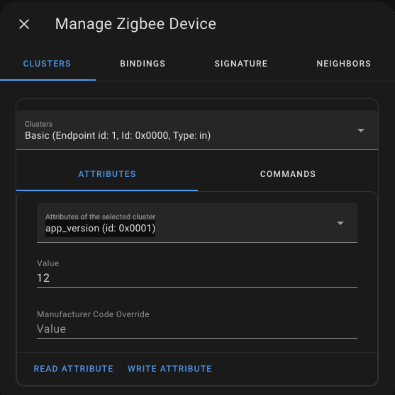
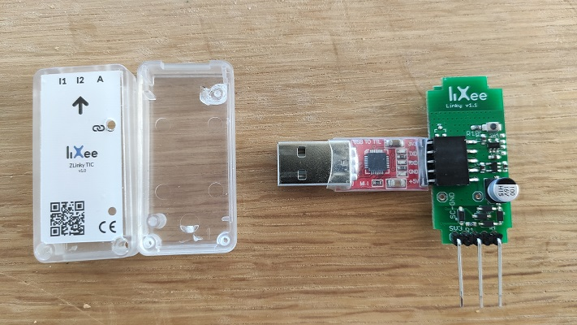
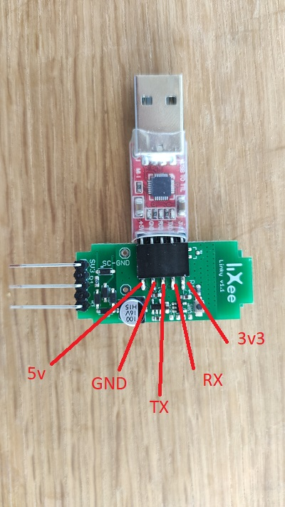
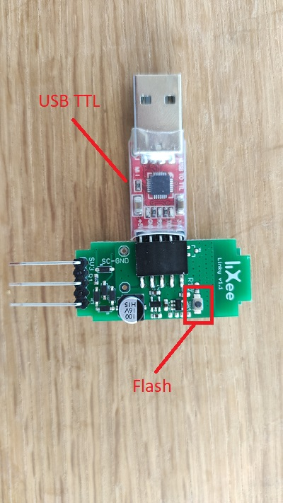

# Documentation
[La documentation officielle](https://github.com/fairecasoimeme/Zlinky_TIC)  
[Des informations sur l'integration dans ZHA](https://bestofcpp.com/repo/fairecasoimeme-Zlinky_TIC)  
[Connecter simplement Linky en zigbee](https://forum.hacf.fr/t/zlinky-tic-ou-connecter-simplement-linky-en-zigbee/7112)  
[Clé ZLINKY lixee avec ZHA + Conbee2_Remonter dans ENERGIE HP/HC](https://forum.hacf.fr/t/cle-zlinky-lixee-avec-zha-conbee2-remonter-dans-energie-hp-hc/9058)  
[How to update your IKEA or Ledevance firmware with ZHA](https://www.reddit.com/r/homeassistant/comments/fak430/comment/ix0aiwm/?utm_source=share&utm_medium=web2x&context=3)  


# Firmware
## Les firmwares
[Changelog et liens](https://github.com/fairecasoimeme/Zlinky_TIC/releases)  
## Connaitre votre version
Depuis la ficher de l'objet (LiXee ZLinky) / Device Info / Trois points / Manage Zigbee Device / Cluster Basic / app_version (id: 0x0001) / read attribute

## Mise à jour 
### non OTA
Tout d'abord, il faut dévisser le boitier afin de sortir la carte électronique. Ensuite, il faut brancher le module USB TTL sur le ZLinky_TIC comme sur la photo.  
  
Pour ceux qui n'ont pas ce modèle, voici la correspondance des 5 PINs :  
  
Une fois que les branchements sont OK, il suffit d'insérer sur votre ordinateur la clef USB en maintenant le bouton Flash puis relacher.  
  
Enfin vous pouvez [suivre les instructions suivantes](https://zigate.fr/documentation/mise-a-jour-de-la-zigate-2/) (similaire à la mise à jour d'une ZiGate+ (V2))  
### OTA
1. télécharger fichier OTA (on the air) update : https://github.com/fairecasoimeme/Zlinky_TIC/releases
le coller via samba (add on à installer)
dans windows explorer : \\\\[192.168.0.](https://192.168.0.103)IP\\IP\)
puis user : password
puis /config/zigpy\_ota/vXX.ota  
2. modifier configuration.yaml:  
``` yaml
# turn up logging
logger:
  default: info
  logs:  
    homeassistant.components.zha: debug
    zigpy: debug

# enable updates
zha:
  zigpy_config:
    ota:
      otau_directory: /config/zigpy_ota
      ikea_provider: true
      ledvance_provider: true

```
3. dans HA: redémarrer  
paramètres->système->redémarrer  
parfois ça suffit, sinon passer au 4  ÒÒ

4. déclencher la maj :  
[source](https://www.reddit.com/r/homeassistant/comments/fak430/comment/ix0aiwm/?utm_source=share&utm_medium=web2x&context=3)  
dans HA - aller sur l'appareil à maj  
dans le menu avec les 3 boules, à coté de "reconfigurer" en bas du panneau "infos. appareil"  
choisir "gérer l'appareil zigbee"  
choisir "OTA" dans le premier menu "clusters"  
Aller dans l'onglet "commandes"  
choisir "image_notify" dans le menu déroulant  
choisir le premier bouton "Jitter"  
Augmenter le slider a 1 (ou plus)  
Descendre et cliquer sur "emttre la commande zigbee", même si il est grisé  
Chercher "OTA upgrade progress" dans les logs (paramètres -> système -> journaux)  
Ensuite, attendre au moins 10/30 minutes.  
